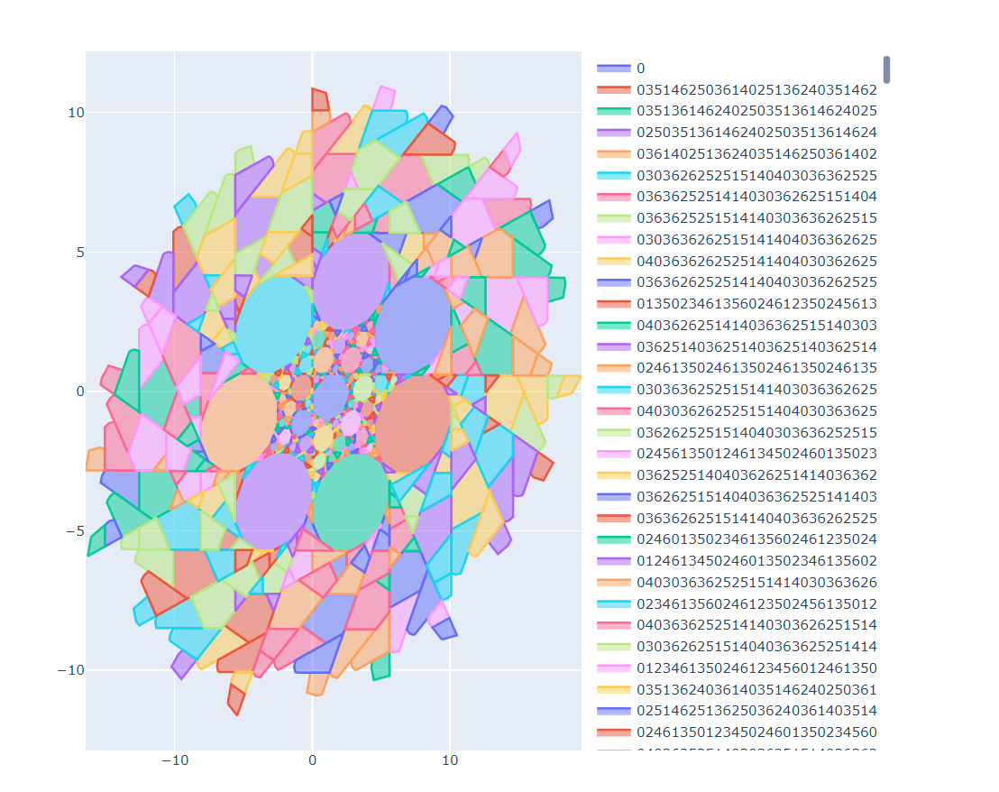

# 7gon-goodies

Generates tiles of septagon external billiard with paths displayed on hover using sagemath and plotly.

For more information about external billiards check out this paper: https://bmm2021.mca.nsu.ru/download/vshe_d_dynamic/Full_description.pdf

Preview of the billiard:

For zooming download the [7gon_final_form.html]() file. [7gon_gen.ipynb]() reproduces this file.

Billiard is separated into 7 regions. Numbers on the right represent which regions are visited bu the point until it arrives at the colored region.
